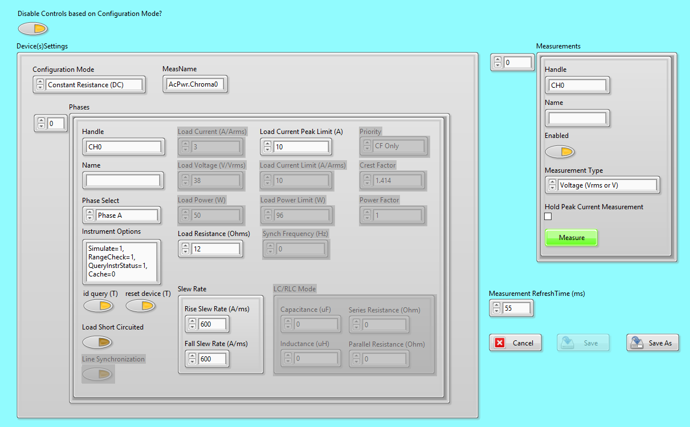
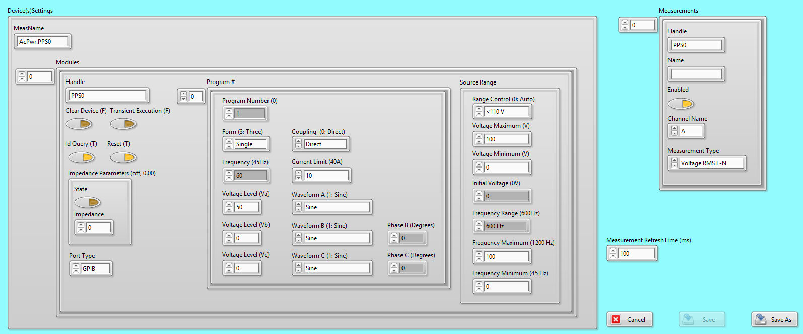

###############
AC Power Module
###############
*************************
Class Specification
*************************

BaseClass
============================

This document describes the properties and methods of a single or multi-phase 
AC Power instrument and additional features of more complex instruments. 
These properites and methods are based upon the IviACPwr Specification 
(https://www.ivifoundation.org/downloads/Class%20Specifications/IVI-4.5_ACPwr_2011-03-11.pdf). Only some of the properties/methods mentioned in the IviACPwr Specification were used in the class specification. 
All plugins (children) inherit all the properties and methods from this base class (parent) and some plugins may have properties and methods specific to the plugins. 
If a plugin simply inherits the method or property from the base class then this property or method will not be menitoned (needs review to ensure this statement is accurate). 
Unique properties and methods will be mentioned and properties and methods that are unused by the plugins will aslo be mentioned (work needed here). 

|image12|

Figure \: AcPwrBaseClass UML specification

Properties
~~~~~~~~~~
Frequency \: double
 The frequency setpoint for all phases.
 

            	
Methods
~~~~~~~

Initialize()
  Opens a connection to all phases.  optionally reset the phase or check that the phase ID is valid.
  
ConfigPhases()
  Configure all phases with their property values
  
ConfigFrequency()
  Configure the frequency of all phases to the single frequency property value.
  
Disable()
   Cause all phases to apply the minimum ampout of power possible.  The devise remains connected after disablew.
   
ResetCurrentProtection()
   If the phases have tripped on over current, this method resets the overcurrent protection if the user has manually reset the Enabled property to true.  Note that during a protection event, the enabled property must be automatically cleared.
   
ResetVoltageProtection()
   If the phases have tripped on over or under voltage, this method resets the protection and re-enables the phases if the user has manually reset the Enabled property to true.  Note that during a protection event, the enabled property must be automatically cleared.
   
Reset()
    Disable all phases and return all properties to default values.

Measurement Extension Group   
============================
|image13|

Figure \: AcPwrMeasurement Extension Group UML specification

This extension group provides the ability to measure AC power source output signals such as voltage and current. 

Methods
~~~~~~~
Initiate Measurement() 
	Initiates a measurement of one or more measurement groups for all output phases. You can specify multiple groups. 

FetchMeasurement()
	Returns the value measured by a previous call to the Initiate Measurement function. The Fetch Measurement function returns a single measured value for the requested measurement type. Call this function multiple times to retrieve the available measurement types and output phases. The available measurement types are divided into measurement groups. Use the Initiate Measurement function to measure fresh values for that group.

FetchMeasurementArray()
	Returns the values measured by a previous call to the Initiate Measurement function. The Fetch Measurement Array function returns an array of measured values of the requested measurement type. Call this function multiple times to retrieve the available measurement types and output phases. The available measurement type are divided into measurement groups. Use the Initiate Measurement function to measure fresh values for that group

Properties
~~~~~~~~~~
	
	Handle \: string
	  A unique identifier of the hardware supporting the phase.

	Type \: enum
	   The type of measurement to be made:
		-Voltage RMS L-N  
		
		-Current RMS
		
		-Frequency
		
		-Voltage DC
		
		-Current DC
		
		-Power Factor
		
		-Crest Factor
		
		-Current Peak
		
		-Power VA
		
		-Real Power
		
		-Power DC
		
		-Phase Angle
		
		-Voltage RMS L-L
		
		-Current OHD
		
		-Current EHD
		
		-Current THD
		
		-Voltage OHD
		
		-Voltage EHD
		
		-Voltage THD
		

Phase Extension Group   
============================
|image14|

Figure \: AcPwrPhase Extension Group UML specification

Current Protection Extension Group   
============================
|image15|

Figure \: AcPwrCurrent Protection Extension Group UML specification

Voltage Protection Extension Group   
============================
|image16|

Figure \: AcPwrVoltage Protection Extension Group UML specification

Impedance Extension Group   
============================
|image17|

Figure \: AcPwrImpedance Extension Group UML specification

DCGeneration Extension Group   
============================
|image18|

Figure \: AcPwrDCGeneration Extension Group UML specification

NON-IVI Extension Group    
=======================
In order to get full functionality of each plugin and allow plugin interoperability additional base methods and properties were needed and are discussed below. 

Properties
~~~~~~~~~~

Measurement \: [struct]
	An array of structures containing properties of each measurement to be made

	Name \: string
	 The name of the phase.  In all cases this is for the conveinience of the end user. 
	 
	Enabled \: boolean
	  Set by the end user to determine if the phase should be enabled (energized) or disabled (de-energized).

PluginConfigVariant \: Variaint
	This contains any new configuration properties of the plugin(child) that are not in the Base class (parent).
		
PluginMeasVariant \: Variant
	This contains any new measurement properties of the plugin(child) that are not in the Base class (parent).
	
RefreshTime \: double
   The time delay between fetching individual measurements

Methods
~~~~~~~
StartMeas ()
	Starts the instruments acquistion of measurements. 
	
StopMeas ()
	Stops the instruments acquisition of measurements. 
	
ChangeWhileMeasuring () 
	Returns if the instrument can configure it's output settings, or commit those settings like updating output value while it is in the process of acquiring measurements. 

DefaultFromINI()
	Returns the current configuration stored in the INI file. 

PrefDialog (Device Specifc Insturment Configuration)
	Displays the prior instruments properties and allows a user to change the  instrument properties and save these new set properties to the same location on disk or in a new location with a new name called "Type". 

DeviceOn ()
	Enables the output. 
	
DeviceOff ()
	Disables the output.

ConfigDevice ()
	Configures the instrument based on the INI file settings or changes to these settings made using the PrefDialog.vi. This function call contains a set of configuration functions such as ConfigPhases and ConfigFrequency.

GetSettings ()
	This function retrieves the instrument properties. 
	
SetSettings ()
	This function sets the instruments properties.  

	
Chroma AcLoad Class
===================

The Chroma AC Load is a one channel instrument capable of simulating various AC and DC loads based upon power, resistance, or current. This device support one phase per device so multiple devises must be used to create multiple phases. One Module can support up to three devices 
so with a single module all three phases can be emulated. The IVI AC Power specification does not (yet) peovide an extension group for AC Loads but it seems to make sense to extend it.  Eventually this child class may become a base class for generic AC loads. The following sections detail additional 
properties and methods that are unique from the base class and Property Dialog window that will allow an operator to configure the instrument. 

|image8|

Configuration Dialog Properties and Operation Modes
~~~~~~~~~~~~~~~~~~~~~~~~~~~~~~~~~~~~~~~~~~~~~~~~~~~

*The following section lists the properties and operational mode of the AC/DC Chroma Load (638xx). Each mode uses a set of properties that are similar and distinct from the rest. If a variable is listed under an operation mode, it must be configured in order for the Chroma to operate. **The load should be appropriately configured for the physically wiring and the source connected**. 

|image2|

*This is the preference dialogue screen that allows the user to configure the device.*

	- Disable Controls Based On Configuration Mode?: A property that allows the disables various properties based on the value of the configuration variable. 
	- Device(s)Settings: A collection of properties that allow a user to control the instrument. 
		- Configuration Mode: The operation modes of the device. The user must be careful to select an appropriate current type or the device will fail to configure.
			- Constant Voltage (DC): The device attempts to operate as a constant voltage load.
			- Constant Power (DC): The device attempts to operate at a constant DC power.
			- Constant Power (AC): The device attempts to match the value of the RMS current to an amount specified by the user
			- Constant Current (DC): The device attempts to operate at a constant DC current.
			- Constant Current (AC): The device attempts to match the value of the RMS power to an amount specified by the user.
			- Constant Resistance (DC): The device attempts to emulate a resistor with a constant value
			- Constant Resistance (AC): The device attempts to emulate a resistor with a constant value
			- Rectified Mode (DC): The device converts a DC signal into an AC output.
			- Inrush (AC): **Note**: Measuring the inrush current of the device is tricky, seeing as the mode quickly turns off. In order to perform measurements on this device, the user is recommended to use the *Set Peak Current Meas Hold* vi with the input set to *true*, then using the *Measure or Fetch Peak Current* vi.
			- RLC CP (AC): The load emulates an RLC circuit operating a constant RMS power. An inductor is in series and a capacitor is in parallel.
			- RLC (AC): The load emulates an RLC circuit, with an inductor in series and a capacitor in parallel.
		- MeasName: Every measurement from this module will be labeled with the value entered into this variable. 
		- Phases: A cluster of properties that determines the properties of each phase. 
			- Handle: The name of the insturment with which software can use to connect and control the instrument. 
			- Name: A distinct software name that an operator may use to distinguish instruments. 
			- Phase Select: Determines the phase of the instrument
			- Instrument Options: Allows for instrument initializations commands such as simulation (Simulation=0).
			- id query: If set to true queries the instrument ID and checks that it is valid for this instrument driver. 
			- reset device: If this property is true a software command is sent that initializes the instrument back to the default state. 
			- Load Short Circuited: The instrument shorts its input.
			- Line Synchronization: In Rectified mode this Boolean when set to true uses the measured input frequency as the reference loading frequency.  
			- Load Current: The current the instrument will try to sink.   
			- Load Voltage: The voltage the instrument will try to sink. 
			- Load Power: The Power that the instrument will try to sink. 
			- Load Resistance: The input resistance set at the instruments' input. 
			- Load Current Peak Limit: A user defined limit where the instrument will throw an error if the measurements exceed the value.
			- Load Current Limit: A user defined limit that allows the instrument to return an error if the current measurement exceeds the set value.
			- Load Power LImit: A user defined limit that allows the instrument to return an error if the Power measurements exceeds the set value. 
			- Synch Frequency: In Rectified Mode and if the Boolean is set to false the synch frequency must be set to the expected input frequency.  
			- Priority: Determines if the the instrument should optimize. for the crest factor or the power factor. 
			- Crest Factor: The instrument will try to establish a ration such that the value set = Peak Current/ RMS Current.
			- Power Factor: The instrument will try to establish a ratio such that the value set = Real Power/Apparent Power. 
	- Measurements: A collection of properties that allow user to control the instuments measurements. 
		- Handle: The name of the instrument and channel with which the software will use to collect measurements. 
		- Name: A distinct software name that an operator may use to distinguish instruments and/or channels.
		- Enabled: This property determines if the measurement data is acquired or not. 
		- Measurement Type: A property that determines what type of measurement the instrument will report back.  
			-Voltage
			
			-Current
			
			-Power
			
			-Peak Voltage
			
			-Peak Current
			
			-Peak Power
			
			-Frequency
			
			-Resistance
			
			-Voltage Overshoot
			
			-Positive Peak Current
			
			-Voltage Undershoot
			
			-Negative Peak Current
			
			-Apparent Power
			
			-Reactive Power
			
			-Voltage THD
			
			-Power Factor
			
			-Current's Crest Factor
		- Hold Peak Current Measurment: This property allows the instrument to return the value based on magnitude. It is only
		- Fetch/Read: A property that determines how the measurement is taken. 
	- Measurement RefreshTime: The time in milliseconds to wait between the instruments' measurements.
	- Cancel: Closes the window and discards any changes to the settings
	- Save: Closes the panel and saves these settings to an INI file. 
	- Save As: Closes the panel and saves these settings to a different INI file in the same file location. 		

	   
Unique Methods
~~~~~~~~~~~~~~

CheckHandle()
	Check to see if the input handle is already connected. 

CheckSettings
	Checks the value of the instrument settings and returns an error if the value is outside the instruments range. 

ChromaProtectionStatus()
	Retrieves a string status from the Chroma indicating any measurment errors. 

ConvertStatus()
	Converts the instruments numerical status into a string status. 

DisableControls
	disables the controls in the phases cluster based on the Configuration Mode control. This will enable the user to only change the values of the controls that are allowed by that mode.  
	
NumOfPhases
	Checks the number of phases and ensures it is less than or equal to three. 
	
SupportedMeasurementType
	Checks if the Measurment Type(s) selected is capable by the instrument based on the current instruments configuration. 
	
VariantToProperties
	Extracts the PluginConfigVariant, PluginMeasVariant, and Measurement Refersh Time. Converts PluginConfigVariant and PluginMeasVariant into the Configuration and Measurement Cluster. 
	
WriteToBaseConfigVariant
	Writes to the PluginConfigVariant and the PluginMeasVariant properties.  

NHRDC Power Class
=================
*The NHR 9200 is a Battery Test Simulator. Within each NHR 9200 are three 
NHR 4960 that serave as DC output, DC Load, or a Battery. Each NHR 4860 has one single channel. 
The following section lists the user accessible properties, operation mode, 
and unique methods of the NHR 9200 DC Battery Test System.*

|image9|

Configuration Dialog Properties and Operation Mode
~~~~~~~~~~~~~~~~~~~~~~~~~~~~

|image3|

*This is the preference dialogue screen that allows the user to configure the device.*

	- Device(s)Settings: A collection of properties that allow a user to control one or multiple instrument. 
		- MeasName: Every measurement from this module will be labeled with the value entered into this variable. 
		- Modules: A collection of properties that allows for the control of one or multiple instruments. 
			- Handle: The name of the insturment with which software can use to connect and control the instrument.
			- Name: A distinct software name that an operator may use to distinguish instruments.
			- id query: If set to true queries the instrument ID and checks that it is valid for this instrument driver.
			- reset device: If this property is true a command is sent to the device 
			- Options String: Allows for instrument initializations commands such as simulation (Simulation=0).
			- Operating State: The operation modes of the device. The user must be careful to select an appropriate current type or the device will fail to configure.
				- Off - The module is off when in the Stand-by state, providing no voltage, current, power or resistance.
				- Stand By - The module is off when in the Stand-by state, providing no voltage, current, power or resistance.
				- Charge - The module acts as a Source where the Voltage property control the output voltage, and the Current, Power and Resistance properties define the operating limits.
				- Discharge - The module acts as a Load, where the Voltage, Current, Power and Resistance values concurrently control the state of the module - the mode drawing the least amount of current being the dominant mode.
				- Battery Emulation - The module acts as a Battery, where it sinks or sources current automatically based on the sensed voltage. Use the Voltage, Current, Power and Resistance fields to configure the behavior of the emulated battery.
			- Initial Battery Detect Voltage: A property that sets the initial voltage which the instrument must see at its outpu before it begins to source or sink current. 
			- Aperture Time: A property that set the maximum window with which the instrument is allowed to gather measurements before it returns. The instruments is always acquiring data at the maixmum rate. This property determines the amount of time 
			- Regulation Gain: This property sets the distance the output will try to move when the set value does not equal the measurement value. 
			- OutputSettings: A collection of properties that determines the ouput values of the instrument. Additional values in the array are ignored unless the Enable Macro Property is set to true. 
				-Enable Voltage: This property configures the instrument to set the voltage output or input. 
				
				-Voltage: If the Enable Voltage property is set to true the value of this property is used to set the maximum value. 
				
				-Enable Current: This property configures the instrument to set the current output or input. 
				
				-Current: If the Enable Voltage property is set to true the value of this property is used to set the maximum value.
				
				-Enable Resistance: This property configures the instrument to set the resistance output or input.
				
				-Resistance: This property sets the value of the sereies output resistance.
				
				-Enable Power: This property configures the instrument to set the power output or input. 
				
				-Power: If the Enable Power property is set to true the value of this property is used to set the maximum value. 
				
				-Enable Wait: This property enables the instrument to wait to set an output value until a certain conditions is met. 
				
				-Wait Value: If the Enable Wait property is set to true the value of this property is used to set the threshold value a measurement must cross before setting the output value.
				
				-Wait On Value: If the Enable Wait property is set to true the value this property allows the sets the conditions for the wait. 
					-Voltage Greater Than or Equal To
					
					-Voltage Less Than or Equal To
					
					-Current Greater Than or Equal To
					
					-Current Less THan or Equal To
					
					-Power Greater Than or Equal To
					
					-Power Less Than Or Equal To
				-Macro After Step Delay: This property allows the uer to set a time delay in seconds after each step.
			- SlewRate: A cluster of properties used to set the slew rate
				-Set Voltage Rate V/S: This property sets how quickly the Voltage can change per second. 
				
				-Set Current Rate A/S: This property sets how quickly the Current can change per second. 
				
				-Set Resistance Rate R/S: This property sets how quickly the Resistnace can change per second. 
				
				-Set Power Rate W/S: This property sets how quickly the Power can change per second. 
			- SafetySettings: A cluster of properties used to set the instruments parameters that will prevent damage to the instrument or any external devices connected to it. 
				-SetWatchDog: Enables the instrument to turn off its output if the cotroller has not sent any command to the instrument in 10 seconds. 
				
				-Voltage: This property sets the maximum voltage value that the insturment will source or sink. If the measurement value exceeds this value longer than the VoltageDelay property the output will enter a high impedance state. 
				
				-VoltageDelay: This property sets the amount of time the measured voltage is allowed to exceed the Voltage Safety Property before the ouptut goes into a high impedance state. 
				
				-Current: This property sets the maximum current value that the insturment will source or sink. If the measurement value exceeds this value longer than the PowerDelay property the output will enter a high impedance state.
				
				-CurrentDelay: This property sets the amount of time the measured current is allowed to exceed the Current Safety Property before the ouptut goes into a high impedance state. 
				
				-Power: This property sets the maximum power value that the insturment will source or sink. If the measurement value exceeds this value longer than the PowerDelay property the output will enter a high impedance state.
				
				-PowerDelay: This property sets the amount of time the measured power is allowed to exceed the Power Safety Property before the ouptut goes into a high impedance state. 
			- Macro
				-UseMacros?: Set this property to true in order to enable the use of multiple Output Settings to control the instrument.
				
				-RunMacroContinuously?: Set this property to true in order to have multiple output settings repeated for an infinite number of times. 
				
				-LoadMacroFromFile?: Set this property to true in order to load a set of instructions from a location on disk. 
				
				-LoadMacroFilePath: The location on disk that the instructions will be loaded from if the Load Macro From File? property is set to true. 
				
				-SaveMacro: Set this property to true to save the current macro to a file. 
				
				-SaveMacroFilePath: The location on disk that the current configured set of instruction will be 
	- Measurements: A collection of properties that allow user to control the instuments measurements.
		- Handle: The name of the instrument and channel with which the software will use to collect measurements.
		- Name: A distinct software name that an operator may use to distinguish instruments and/or channels.
		- Enabled: This property determines if the measurement data is acquired or not.
		- Measurement Type: A property that determines what type of measurement the instrument will report back.
			-Power
			-Voltage
			-Current
	
	- Measurement RefreshTime: The time in milliseconds to wait between the instruments' measurements.
	- Cancel:Closes the window and discards any changes to the settings
	- Save:Closes the panel and saves these settings to an INI file. 
	- Save As:Closes the panel and saves these settings to a different INI file in the same file location. 

Unique Methods
~~~~~~~~~~~~~~

CheckHandle()
	Check to see if the input handle is already connected. 

CheckSettings
	Checks the value of the instrument settings and returns an error if the value is outside the instruments range. 

ChromaProtectionStatus()
	Retrieves a string status from the Chroma indicating any measurment errors. 

ConvertStatus()
	Converts the instruments numerical status into a string status. 

DisableControls
	disables the controls in the phases cluster based on the Configuration Mode control. This will enable the user to only change the values of the controls that are allowed by that mode.  
	
NumOfPhases
	Checks the number of phases and ensures it is less than or equal to three. 
	
SupportedMeasurementType
	Checks if the Measurment Type(s) selected is capable by the instrument based on the current instruments configuration. 
	
VariantToProperties
	Extracts the PluginConfigVariant, PluginMeasVariant, and Measurement Refersh Time. Converts PluginConfigVariant and PluginMeasVariant into the Configuration and Measurement Cluster. 
	
WriteToBaseConfigVariant
	Writes to the PluginConfigVariant and the PluginMeasVariant properties.

NHR Regenerative Grid Simulator
===============================

The NHR Regenerative Grid Simulator is a three channel AC or DC Output that can be combined into any combination between one and three channels. A single module can  

|image10|

Configuration Dialog Properties and Operation Modes
~~~~~~~~~~~~~~~~~~~~~~~~~~~~~~
The following section lists every user accesible property of the NHR 9210 AC/DC RegenerativeGrid Simulator. 

|image4|

*This is the preference dialogue screen that allows the user to configure the device.*

	- Device(s)Settings: A collection of properties that allow a user to control the instrument. 
		- MeasName: Every measurement from this module will be labeled with the value entered into this property. 
		- Modules: A collection of properties that allows for the control of one or multiple instruments.
			- Handle: The name of the insturment with which software can use to connect and control the instrument.
			- id query: If set to true queries the instrument ID and checks that it is valid for this instrument driver.
			- reset: If this property is true a software command is sent that initializes the instrument back to the default state.
			- Initialize Timeout: The maximum time in seconds that the instrument can spend initializing the instrument. 
			- Regulation Gain: This property sets the distance the output will try to move when the output value does not equal the measurement value.
			- Phases: A cluster of properties that determines the properties of each phase.
				-Phase Name: The name of the phase
				
				-Pout: The power output of this phase. 
				
				-Vout: The voltage output of this phase. 
				
				-Iout: The current output of this phase. 
				
				-PhaseAngle: The phase angle of this phase rel
			- Mode: The operation modes of the device. The user must be careful to select an appropriate mode for the physical configuration wired. Pleaee see the following mode section for an explanation of the modes. 
				-One 3-Phase AC
				
				-One AC
				
				-One DC
				
				-Three AC
				
				-Three DC
				
				-One 2-Phase AC and One AC
				
				-One 2-Phase AC and One DC
				
				-Two AC
				
				-One AC and One DC
				
				-Two AC and One DC
				
				-Two AC and One DC
				
				-One AC and Two DC
				
				-One DC and One AC
				
				-Two DC

			- Measurement: A cluster of measurement properties. 
				-Aperture Length: The time that the instrument will be taking measurement. 
				-NumberOfSamples: The amount of measuremnt will take in the set measurement window. 
				
			- Ranges: A cluster of voltage and current range properites. 
				-Irange: The minimum and maximum current that the instrument can output. 
				-Vrange: The minimum and maximum voltage that the instrument can output. 
			- Phase: The phase of all the channels if all the channels are in AC Mode. This setting will overwrite all previously existing phase setting. 
			- FreqOut: Sets the frequeny of the output signal. Only applicapable to channels in AC Mode. 
			- WatchDog: A collection of properties that turns of the instrument if communication between the instrument and the controller is disruptted. 
				-Enable WatchDog: Enable the instrument to turn off its output 
				
				-Robust WatchDog: Enables the instrument to turn off its output if it doesn not receive a specifc set of commands from the controling computer.  The controlling computer has the time allocated in Watchdog Interval
				
				-Watchdog Interval: The maximum amount of time that the instrument can stay disconnected from the controller before it turns of its output. Robust Watchdog or Enable Watchdog must be set to true. 

			- SafteyLimits: 
				-Min Voltage: The instrument will disable its output if the instruments voltage is below this threshold for longer than the time value set in Min Voltage Time property.   
				
				-Min Voltage Time: The maximum time the instrument can stay below the Min Voltage property before the instrument disables its output. 
				
				-Max Voltage: The instrument will disable its output if the instruments voltage is above this threshold for longer than the time value set in Max Voltage Time property.
				
				-Max Voltage Time: The maximum time the instrument can stay above the Max Voltage property before the instrument disables its output. 
				
				-Max Sink Power: The instrument will disable its output if the instruments power is above this threshold for longer than the time value set in Max Sink Power Time property.
				
				-Max Sink Power Time: The maximum time the instrument can stay above the Max Sink Power property before the instrument disables its output. 
				
				-Max Source Power: The instrument will disable its output if the instruments Power is above this threshold for longer than the time value set in Max Source Power Time property.
				
				-Max Source Power Time: The maximum time the instrument can stay above the Max Source Power property before the instrument disables its output.
				
				-Max Sink Amps: The instrument will disable its output if the instruments current is below this threshold for longer than the time value set in Max Sink Amps Time property.
				
				-Max Sink Amps Time: The maximum time the instrument can stay above the Max Sink Amps property before the instrument disables its output.
				
				-Max Source Amps: The instrument will disable its output if the instruments current is below this threshold for longer than the time value set in Max Source Amps property.
				
				-Max Source Amps Time: The maximum time the instrument can stay above the Max Source Power property before the instrument disables its output.
				
				-Peak Voltage: A threshold voltage value that if the instrument exceeds and the Peak Voltage Enable value is set to true will cause the instrument to turn off. 
				
				-Peak Voltage Enable: Enables the instrument to turn of the output if the peak voltage value is exceeded.
				
				-Peak Amps: A threshold current value that if the instrument exceeds. 
				
				-Peak Amps Enable: Enables the instrument to turn of the output if the peak current value is exceeded. 
		
	- Measurements: A collection of properties that allow user to control the instuments measurements.
		- Handle: The name of the instrument and channel with which the software will use to collect measurements.
		- Name: A distinct software name that an operator may use to distinguish instruments and/or channels.
		- Enabled: This property determines if the measurement data is acquired or not.
		- Phase: This property sets the measurement to acquire from the selected phase. 
		- Measurement Type: A property that determines what type of measurement the instrument will report back.
			-Average Current
			-Average Voltage
	
	- Measurement RefreshTime (ms):The time to wait between the instruments' measurements.
	- Cancel:Closes the window and discards any changes to the settings
	- Save:Closes the panel and saves these settings to an INI file. 
	- Save As:Closes the panel and saves these settings to a different INI file in the same file location. 
Mode
----

*The following variables are used by every operation mode*

	- Mode: The operation modes of the device. The user must be careful to select an appropriate mode that matches the physical configuration the instrument is currently configured for and the type of loads connected to the instrument. 
|image6|

*These are the various modes of the NI 9410 Regenrative Grid Simulator.* 

Unique Methods
~~~~~~~~~~~~~~

CheckHandle()
	Check to see if the input handle is already connected. 

CheckSettings
	Checks the value of the instrument settings and returns an error if the value is outside the instruments range. 

ChromaProtectionStatus()
	Retrieves a string status from the Chroma indicating any measurment errors. 

ConvertStatus()
	Converts the instruments numerical status into a string status. 

DisableControls
	disables the controls in the phases cluster based on the Configuration Mode control. This will enable the user to only change the values of the controls that are allowed by that mode.  
	
NumOfPhases
	Checks the number of phases and ensures it is less than or equal to three. 
	
SupportedMeasurementType
	Checks if the Measurment Type(s) selected is capable by the instrument based on the current instruments configuration. 
	
VariantToProperties
	Extracts the PluginConfigVariant, PluginMeasVariant, and Measurement Refersh Time. Converts PluginConfigVariant and PluginMeasVariant into the Configuration and Measurement Cluster. 
	
WriteToBaseConfigVariant
	Writes to the PluginConfigVariant and the PluginMeasVariant properties.

Pacific Power Source
====================

The Pacific Power 360AMXT is a three channel AC Souurce that supports combining all three channels into one channel or being combined into a split phase operation.

|image11|

Configuration Dialog Properties and Operation Modes
~~~~~~~~~~~~~~~~~~~~~~~~~~~~~~
*The following section lists every user accesible property of the PPS360AMXT Pacific Power Supply.* 

|image5|

*This is the preference dialogue screen that allows the user to configure the device.*

	- Device(s)Settings: A collection of properties that allow a user to control the instrument. 
		- MeasName: Every measurement from this module will be labeled with the value entered into this property. 
		- Modules: A cluster of properties that determines the properties of each instrument.
			- Handle: The name of the insturment with which software can use to connect and control the instrument.
			- Clear Device: If set to true clears all the previous settings. 
			- Transient Execution: 
			- ID Query: If set to true queries the instrument ID and checks that it is valid for this instrument driver.
			- Reset: If this property is true a software command is sent that initializes the instrument back to the default state.
			- Impedance Parameters: A cluster of parameters that sets the instruments output's impedance. 
				-State: If true enables the output impedance. 
				-Impedance: The output impedance value that the instrument ouptut will be set to. 
			- Port Type: This informs the instrument what physical connection type exsist between the controller and the instrument. 
				- GPIB
				- Serial
			- Program #: A cluster of properties that allows sets the voltage, current, and various other properties for the output channel. 
				-Program Number: A number identifier for the cluster properties. An operater can store numerous different combinations of properties by using 
				
				-Form: A cluster of the output modes. See form section below for more details. 
					-Single
					
					-Split
					
					-Three
				-Coupling:
					-Direct
					
					-Transformer
				-Frequency: The output frequency of all the channel(s).
				
				-Current Limt: The maximum current any channel on the instrument can provide. 
				
				-Voltage Level: The peak voltage level that channel A can provide.
				
				-Waveform A: The shape of the output signal from channel A. 
					-Sine
					
					-Waveform 2
					
					-Waveform 3
					
					-Waveform 4
					
					-Waveform 5
					
					-Waveform 6
					
					-Waveform 7
					
					-Waveform 8
					
					-Waveform 9
					
					-Waveform 10
					
					-Waveform 11
					
					-Waveform 12
					
					-Waveform 13
					
					-Waveform 14
					
					-Waveform 15
					
					-Waveform 16
					
					-Waveform 17
					
					-Waveform 18
					
					-Waveform 19
					
					-Waveform 20
					
					-Waveform 21
					
					-Waveform 22
				-Voltage Level: The peak voltage level that channel B can provide.
				-Waveform B: The shape of the output signal from channel B.
					-Sine
					
					-Waveform 2
					
					-Waveform 3
					
					-Waveform 4
					
					-Waveform 5
					
					-Waveform 6
					
					-Waveform 7
					
					-Waveform 8
					
					-Waveform 9
					
					-Waveform 10
					
					-Waveform 11
					
					-Waveform 12
					
					-Waveform 13
					
					-Waveform 14
					
					-Waveform 15
					
					-Waveform 16
					
					-Waveform 17
					
					-Waveform 18
					
					-Waveform 19
					
					-Waveform 20
					
					-Waveform 21
					
					-Waveform 22
				-Phase B: The delay in the signal coming from channel B with respect to channel A
				
				-Voltage Level: The peak voltage level that channel C can provide.
				
				-Waveform C: The shape of the output signal from channel C.
					-Sine
					
					-Waveform 2
					
					-Waveform 3
					
					-Waveform 4
					
					-Waveform 5
					
					-Waveform 6
					
					-Waveform 7
					
					-Waveform 8
					
					-Waveform 9
					
					-Waveform 10
					
					-Waveform 11
					
					-Waveform 12
					
					-Waveform 13
					
					-Waveform 14
					
					-Waveform 15
					
					-Waveform 16
					
					-Waveform 17
					
					-Waveform 18
					
					-Waveform 19
					
					-Waveform 20
					
					-Waveform 21
					
					-Waveform 22
				-Phase C: The delay in the signal coming from channel C with respect to channel A
			- Source Range: A cluster of properties that allows the user to set the output voltage range of the instrument. 
				-Range Control: Sets the voltage output range for the instrument. 
					-Auto
					
					-<110V
					
					-110V-120.9V
					
					-121-130.9V
					
					->131V
				-Voltage Maximum: The maximum output voltage of the instrument. 
				
				-Voltage Minimum: The minimum output voltage of the instrument. 
				
				-Initial Voltage: The initial output voltage of the ac waveform. 
				
				-Frequency Range: Sets the frequency range of the output waveform. 
				
				-Frequency Maximum: Sets the maximum value of the frequency. 
				
				-Frequency Minimum: Sets the minimum value of the freqeuncy. 
	- Measurements: A collection of properties that allow user to control the instuments measurements.
		- Handle: The name of the instrument and channel with which the software will use to collect measurements.
		- Name: A distinct software name that an operator may use to distinguish instruments and/or channels.
		- Enabled: This property determines if the measurement data is acquired or not.
		- Channel Name: This property sets the measurement to acquire from the selected internal channel name. 
		- Measurement Type:  A property that determines what type of measurement the instrument will report back.
			-Voltage RMS L-N
			
			-Voltage RMS L-L
			
			-Frequency
			
			-Current RMS
			
			-Current Peak
			
			-Crest Factor
			
			-Power Factor
			
			-Power VA
			
			-Real Power
	- Measurement RefreshTime: The time to wait between the instruments' measurements.
	- Cancel: Closes the window and discards any changes to the settings
	- Save: Closes the panel and saves these settings to an INI file. 
	- Save As: Closes the panel and saves these settings to a different INI file in the same file location. 

Form
-----------------

*The following variables are used by every operation mode*

	- One - Output is taken from a single channel Phase A. 
	- Split - Output is taken from two channels Phase A and B. 
	- Three - Output is taken from all three channels Phase A, B, and C. 
|image7|

Unique Methods
~~~~~~~~~~~~~~

CheckHandle()
	Check to see if the input handle is already connected. 

CheckSettings
	Checks the value of the instrument settings and returns an error if the value is outside the instruments range. 

ChromaProtectionStatus()
	Retrieves a string status from the Chroma indicating any measurment errors. 

ConvertStatus()
	Converts the instruments numerical status into a string status. 

DisableControls
	disables the controls in the phases cluster based on the Configuration Mode control. This will enable the user to only change the values of the controls that are allowed by that mode.  
	
NumOfPhases
	Checks the number of phases and ensures it is less than or equal to three. 
	
SupportedMeasurementType
	Checks if the Measurment Type(s) selected is capable by the instrument based on the current instruments configuration. 
	
VariantToProperties
	Extracts the PluginConfigVariant, PluginMeasVariant, and Measurement Refersh Time. Converts PluginConfigVariant and PluginMeasVariant into the Configuration and Measurement Cluster. 
	
WriteToBaseConfigVariant
	Writes to the PluginConfigVariant and the PluginMeasVariant properties.

************
Code Design
************

Miscellaneous
=============

Recommended Improvements
~~~~~~~~~~~~~~
-description of properties for the base extension groups
-Verify that properties/methods inhereted from the base class and used in the children class aren't repeated. 
-Note which properties/methods inhereted from the base class and are unused in the children class.
-Group children class properties based on the IVI guidlines (significant change requiring a change to the module code)
-edit the Code Almanac below

******************
Code Almanac
******************

AcPwrModule.lvlib
=================

Private
-------

AcPwrClass vi
^^^^^^^^^^^^^
The AcPwrClass vi acts as a general control for the "Main" module.
	
	+-------------+--------------------------------------------------------------------------------------------------------------------------------------------------------------------------------------------------------------------------------------------------------------------------------------------------------------------------------------------------------------------------------------------------------------------------------------------------------------------------------------------------------------------+
	| **TERMINAL**|	**PURPOSE**                                                                                                                                                                                                                                                                                                                                                                                                                                                                                                        |
	+-------------+--------------------------------------------------------------------------------------------------------------------------------------------------------------------------------------------------------------------------------------------------------------------------------------------------------------------------------------------------------------------------------------------------------------------------------------------------------------------------------------------------------------------+
	|Class In     | Wiring a class into this terminal allows the user to directly override the current class properties of the cloned module.                                                                                                                                                                                                                                                                                                                                                                                          |
	+-------------+--------------------------------------------------------------------------------------------------------------------------------------------------------------------------------------------------------------------------------------------------------------------------------------------------------------------------------------------------------------------------------------------------------------------------------------------------------------------------------------------------------------------+
	|Class Out    | By accessing this terminal, the user can access the class properties of the cloned module. This is the only way the main module has to access its class properties.                                                                                                                                                                                                                                                                                                                                                |
	+-------------+--------------------------------------------------------------------------------------------------------------------------------------------------------------------------------------------------------------------------------------------------------------------------------------------------------------------------------------------------------------------------------------------------------------------------------------------------------------------------------------------------------------------+
	|Set? (F)     | This terminal determines whether the module saves the properties of the *Class In* terminal to the class or not. By default (false), the properties are not saved; this terminal must be set to true in order for a save to occur.                                                                                                                                                                                                                                                                                 |
	+-------------+--------------------------------------------------------------------------------------------------------------------------------------------------------------------------------------------------------------------------------------------------------------------------------------------------------------------------------------------------------------------------------------------------------------------------------------------------------------------------------------------------------------------+
	

AcPwrState.vi
^^^^^^^^^^^^^

The AcPwrState vi acts as a way to control the measurements of the device.
	
	+-------------+--------------------------------------------------------------------------------------------------------------------------------------------------------------------------------------------------------------------------------------------------------------------------------------------------------------------------------------------------------------------------------------------------------------------------------------------------------------------------------------------------------------------+
	| **TERMINAL**|	**PURPOSE**                                                                                                                                                                                                                                                                                                                                                                                                                                                                                                        |
	+-------------+--------------------------------------------------------------------------------------------------------------------------------------------------------------------------------------------------------------------------------------------------------------------------------------------------------------------------------------------------------------------------------------------------------------------------------------------------------------------------------------------------------------------+
	|State In     | Wiring a string variable into this terminal allows the user to control the state of the module's measurement. The string *must* match one of the measurement statuses described in the *Measurements SSM*, otherwise the module will default to the *Idle* state.                                                                                                                                                                                                                                                  |
	+-------------+--------------------------------------------------------------------------------------------------------------------------------------------------------------------------------------------------------------------------------------------------------------------------------------------------------------------------------------------------------------------------------------------------------------------------------------------------------------------------------------------------------------------+
	|State Out    | Outputs a string with a value indicating the status of the module's measurements. The string *should* match one of the measurement statuses described in the *Measurements SSM*, and are sometimes used to control the logic flow of the module.                                                                                                                                                                                                                                                                   |
	+-------------+--------------------------------------------------------------------------------------------------------------------------------------------------------------------------------------------------------------------------------------------------------------------------------------------------------------------------------------------------------------------------------------------------------------------------------------------------------------------------------------------------------------------+
	|Set?         | This terminal determines whether the string input to the *State In* terminal is saved and used to control the state of the measurements loop. By default (false), the value is ignored; the value must be set for true in order for the input to be utilized.                                                                                                                                                                                                                                                      |
	+-------------+--------------------------------------------------------------------------------------------------------------------------------------------------------------------------------------------------------------------------------------------------------------------------------------------------------------------------------------------------------------------------------------------------------------------------------------------------------------------------------------------------------------------+
	

.. |image0| image:: images/AcPwr/image0.png
   :width: 3in

.. |image1| image:: images/AcPwr/image1.png
   :width: 3in

.. |image3| image:: images/AcPwr/image3.png
   :width: 9in	

.. |image4| image:: images/AcPwr/image4.png
   :width: 9in	
   

   
.. |image6| image:: images/AcPwr/image6.png
   :width: 9in	
   
.. |image7| image:: images/AcPwr/image7.png
   :width: 9in	

.. |image8| image:: images/AcPwr/image8.png
   :width: 9in
   
.. |image9| image:: images/AcPwr/image9.png
   :width: 9in	
   
.. |image10| image:: images/AcPwr/image10.png
   :width: 9in	

.. |image11| image:: images/AcPwr/image11.png
   :width: 9in	
   
.. |image12| image:: images/AcPwr/image12.png
   :width: 3in	

.. |image13| image:: images/AcPwr/image13.png
   :width: 3in
   
.. |image14| image:: images/AcPwr/image14.png
   :width: 3in	
   
.. |image15| image:: images/AcPwr/image15.png
   :width: 3in	

.. |image16| image:: images/AcPwr/image16.png
   :width: 3in
   
.. |image17| image:: images/AcPwr/image17.png
   :width: 3in	

.. |image18| image:: images/AcPwr/image18.png
   :width: 3in