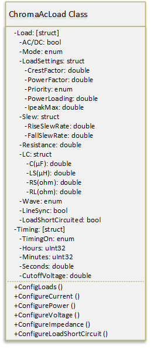

###############
AC Power Module
###############

The AC Power Module is an IVI compliant module with additional plug-in support for an AC load.  At the time of writing, the AC load supported is the Chroma 68300.  The properties and meythods used for this load may be generalized a bit more at a later date.

Class Specification
====================

AcPwrBaseClass
++++++++++++++

All other AcPwr classes inherit from the AcPwrBase class.  Multiple phases (channels of loads) are defined all sharing a common Frequency and Frequency Range.  Each Phase has a Handle which uniquely identifies the hardware supporting that phase.

|image0|

Figure \: AcPwrBaseClass UML specification

Properties
~~~~~~~~~~
Frequency \: double
 The frequency setpoint for all phases.
 
FrequencyRange \: [double] 
 An array of frequencies that limit the upper and lower allowable frequencies, if the array has only one element, then that will be the upper allowable frequency with the lower being 0.  If the array has two elements, then the first element is the lower allowable frequency and the second element is the upper.

Phases \: [struct]
 An array of structures containing the properties of each phase or channel.  

	Handle \: string
	  A unique identifier of the hardware supporting the phase.
	  
	Connected \: bool
	  Used by the system and not end-user settable.  Indicates that the phase has been initialized and is tready to receive further commands.  Closing a phase disconnects the phase and resets Connected.
  
	Name \: string
	 The name of the phase.  In some cases this is for the conveinience of the end user, in other cases, the hardware may need bot a phase Handle and a Name. 
	 
	Enabled \: bool
	  Set by the end user to determine if the phase should be enabled (energized) or disabled (de-energized).
	 
	VoltageLevel \: double
	 Specifies the line-to-neutral voltave level when operating in constant voltage mode.  May also specify a voltage offseyt for an AC voltage
	 
	VoltageRange \: [double]
	   Array of voltages specifying the minimum and maximum allowable voltage levels.  If the array has only one element, then it is the maximum allowable level with the minimum being 0.  If therer are two elements then the first element is the minimum level and the second is the upper limit.
	   
	CurrentLimit \: double
	  Specifies the output current limit.  For the ChromaAcLoadClass this will be *IrmsMax* 
	  
	Waveform \: string
	  The name of the waveform to be generated if the phase is capable of generating waveform functions.	
	  
FunctionClass \: class
  If the phase is capable of generating waveform functions (either standard or arbitrary) this property holds the class reference of the function that creates the waveforms
    
FunctionIniFilePath \: path
  The path to the .ini file holding the properties the waveform function

            	
Methods
~~~~~~~

Initialize(reset\:bool, QueryID\:bool)
  Opens a connection to all phases.  optionally reset the phase or check that the phase ID is valid.
  
ConfigPhases()
  Configure all phases with their property values
  
ConfigFrequency()
  Configure the frequency of all phases to the single frequency property value.
  
Disable()
   Cause all phases to apply the minimum ampout of power possible.  The devise remains connected after disablew.
   
ResetCurrentProtection()
   If the phases have tripped on over current, this method resets the overcurrent protection if the user has manually reset the Enabled property to true.  Note that during a protection event, the enabled property must be automatically cleared.
   
ResetVoltageProtection()
   If the phases have tripped on over or under voltage, this method resets the protection and re-enables the phases if the user has manually reset the Enabled property to true.  Note that during a protection event, the enabled property must be automatically cleared.
   
Reset()
    Disable all phases and return all properties to default values.
    
Measurement Extension Group    
~~~~~~~~~~~~~~~~~~~~~~~~~~~

Properties
~~~~~~~~~~

Measurement \: [struct]
	An array of structures containing properties of each measurement to be made
	
	Handle \: string
	  A unique identifier of the hardware supporting the phase.
	
	Name \: string
	 The name of the phase.  In some cases this is for the conveinience of the end user, in other cases, the hardware may need bot a phase Handle and a Name. 
	 
	Enabled \: bool
	  Set by the end user to determine if the phase should be enabled (energized) or disabled (de-energized).

	Type \: enum
	   The type of measurement to be made:
		Voltage RMS L-N,  
		Current RMS,
		Frequency,
		Voltage DC,
		Current DC,
		Power Factor,
		Crest Factor,
		Current Peak,
		Power VA,
		Real Power,
		Power DC,
		Phase Angle,
		Voltage RMS L-L,
		Current OHD,
		Current EHD,
		Current THD,
		Voltage OHD,
		Voltage EHD,
		Voltage THD
		
	Result \: double
	    The result of the measurement (may eventually become a varient type if any measurement results cannot be represented by doubles).	
		
RefreshTime \: double
   The time delay between fetching individual measurements

Methods
~~~~~~~
InitiateMeasurment (Handle, Enum)
	Initiates all the measurements in the measurements structure for all of the phases that are enabled. Initiate will cause one measurement per structure element to be made.  After Initiate is called, Fetch will return the result of that measurement, then another measurement can be initiated
	
FetchMeasurement (Handle, Name)
	Returns the result of the previous call to the initiate group.  The return value is the entire measurement structure with the Handle, Name, Enabled, Type, and the latest Result 

		
ChromaAcLoadClass
+++++++++++++++++

The Chroma AC load support one phase per device so multiple devises must be used to create multiple phases.  The IVI AC Power specification does not (yet) peovide an extension group for AC Loads but it seems to make sense to extend it.  Eventually this child class may become a base class for generic AC loads.

|image1|

Properties
~~~~~~~~~~
Load \: [struct]
  An array of structures containing the properties used for each Load Device
  
	AC/DC \: bool
	  Specifies the device for AC or DC loading
	  
	Mode \: enum (CC, CP, CR, CV, RLC, Inrush, Rect)
           Specifies the load mode:
		CC = constant current,
		CP = Constant Power,
		CR = Constant Resistance,
		CV = Constant Voltage (DC loading only),
		RLC = Resistance, Inductance, Capacitance (AC loading only),
		Inrush = RLC Inrush Current (AC only),
		Rect = Rectified (DC only).
		
	
	CrestFactor \: double
	   Specifies the load crest factor, meaning of this varies in different modes.
	   
        PowerFactor \: double
	   Specifies the power factor of AC loading.  Essentially this is the phase relationship between the voltage and current.
	   
	Priority \: enum
	    Sets CrestFactor / PowerFactor Priority:
		CF = Crest Factor Priority
		PF = Power Factor Priority
		both (CF) = Both have priority with CrestFactor preferred
		both (PF) = Both have priority with PowerFactor preferred
	
	PowerLoading :\ double
	    Specifies the AC power consumption of the load in Watts

	IpeakMax \: double
		Specifies the maximum peak current that the load will accept
			
	
	Slew \: struct
	    Specifies the rise and fall times of changing properties in the load.
	    
		RiseSlewRate \: double
			Specifies the rising rate of the property depending on Mode
			
		FallSlewRate \: double
			Specifies the falling rate of the property depending on Mode

			
	Resistance :\ double
		Specifies the resistance of the DC load in ohms.  when in CR mode, the Rise and Fall slew times will specify how quickly the resistance will change when this property changes.
		
	LC :\ struct
		A structure containing the Inductive / capacitive properties of the load
		
		C :math:`(\mu F)` \: double
			Specifies the Capacitance when in AC RLC mode
			
		L :math:`(\mu H)` \: double
			Specifies the Inductance when in AC RLC mode
			
		RL(ohm) \: double
			Specifies the (inductive) impedance in AC RLC mode
			
		RS(ohm) \: double
			Specifies the (capacitive) impedance in AC RLC mode
			
	Wave \: enum
		Specifies the wave polarity
			Pos,
			Neg,
			Both,
			
	LineSync \: bool
		True if the load is to be synchronized to the line input.

LoadShortCircuited \: bool
	Specifies that the load is in the short circuited mode.
	   
Timing \: struct
	Single structure defines the timing of all phases
	
	TimingOn :\ enum
		Specifies the timing mode for all phases 
			Holdup,
			Off,
			Transfer
	
	Hours \: uint32
		
	Minutes \: uint32
		
	Seconds \: double
		
	CutoffVoltage \: double
		
	   
Methods
~~~~~~~

ConfigLoads()
	Configures the load modes, current shape, and relative phase of current to voltage

ConfigCurrent()
	Configures the current properties of the loads.  In CC mode, the Rise and Fall Slew rates detetermine how fast the current changes when the properties are changed.
	
ConfigPower()
	Configures the systems power loading
	
ConfigVoltage()
	Sets the DC voltage when in CV mode.  Only in DC modes.
	
ConfigImpedance()
	Configures the loads impedance settings
	
ConfigureShortCircuited()
	Places the load into or returmns from short circuited mode
		

.. |image0| image:: images/AcPwr/image0.png
   :width: 3in

   
