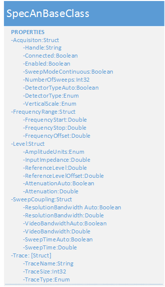
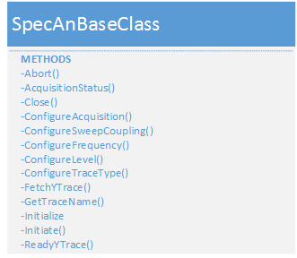

###############
SpecAn Module
###############

The SpecAn Module is an IVI compliant module.  The properties and meythods used for this instrument may be generalized a bit more at a later date.

Class Specification
====================

SpecAnBaseClass
+++++++++++++++

All other Spectrum Analyzers classes inherit from the SpecAnBase class.  

|image0|

Figure \: SpecAnBaseClass Properties UML Specification

Properties
~~~~~~~~~~

Acquisition \: Struct
 A structure containing the properties of each module which pertain to the acquisition.  
	
	Handle \: String
	  A unique identifier of the hardware supporting the acquisition.
	  
	Connected \: Boolean
	  Used by the system and not end-user settable.  Indicates that the module has been initialized and is ready to receive further commands.  Closing an acquisition disconnects the acquisition and resets Connected.

	Enabled \: Boolean
	  Set by the end user to determine if the hardware should be enabled or disabled.
  
	SweepModeContinuous \: Boolean
	  If true the sweep mode is acquiried continuously and if false the sweep mode is not continuous. 
	  
	NumberOfSweeps \: Int32
	  Determines the number of sweeps to acquire. A Sweep is definied by adjusting the frequency of the tuner from the start frequency to the stop frequency in a defined amount of time.  
  
	DetectorTypeAuto \: Boolean
	  Set by the user to allow the API to automatically select the detector type.  
	 
	DetectorType \: Enum
	  Specifies the detection method used (Average, Maximum Peak, etc) to capture and process the signal.
	 
	VerticalScale \: Enum
	 Specifies the vertical scale (log amplifiers versus linear amplifiers) of the measurment hardware.
	 
	MaximumTime \: Double
	 Specifies the maximum amount of time in seconds that the fetch or read function will attempt to retrieve data before the funciton returns. 
	 
Frequency \: Struct
 A structure containing the properties of each module which pertain to the Frequency.   
	
	FrequencyStart \: Double
	  Specifies the left edge of the frequency domain. This is used in conjunction with the Frequency Stop property to define the frequency domain. If the Frequency start is equal to the Frequency Stop attribute value then the spectrum analyzer's horizontal attributes are in the time-domain. 
	  
	FrequencyStop \: Double
	  Specifies the right edge of the frequency domiain. This is used in conjunction with the Frequency Start property to define the frequency domain. If the Frequency start is equal to the Frequency Stop attribute value then the spectrum analyzer's horizontal attributes are in the time-domain. 
	  
	FrequencyOffset \: Double
	  Specifies an offset value, in Hertz, that is added to the frequency readout. The offset is used to compensate for external frequency conversion. This changes the driver's Frequency Start and Stop attributes. The equations relating the affected values are  

		
		Frequency Start = Actual Start Frequency + Frequency Offset
	
		Frequency Stop = Actual Stop Frequency + Frequency Offset
	  

Level \: Struct
 A structure containing the properties of each module which pertain to the input signal level.    

	AmplitudeUnits \: Enum
	  Specifies the unit (dBm, dBmV, dBuV, or etc) for input, output, and display. 
	  
	InputImpedance \: Double
	  Specifies the value of the input impedance in ohms expected at the active input port. This is typically 50 or 75 ohms. 
  
	ReferenceLevel \: Double
	  The calibrated vertical poition of the captured data used as a reference for amplitude measurements. This is typically a value slightly higher than the largest expected signal level. The units are determined by the Amplitude Units attribute.  
	 
	ReferenceLevelOffset \: Double
	  Specifies an offset for the Reference Level attribute. This value is used to adjust the reference level for the external signal gain or loss. A positive value corresponds to a gain while a negative number corresponds to a loss. Th value is in dB.
	 
	AttenuationAuto \: Boolean
	  If set to True, the attenuation is automatically selected otherwise the resolution bandwidth must be set by the user. 
	 
	Attenuation \: Double
	  Specifies the input attenuation in positive dB.
	   
	  
SweepCoupling \: Struct
 A structure containing the properties of each sweep. A sweep is thought of as adjusting the frequency of a tuner from the start frequency to the stop frequency in a defined amount of time.    

	ResolutionBandwidthAuto \: Boolean
	  If set to True, the resolution bandwidth is automatically selected otherwise the resolution bandwidth must be set by the user. 
	  
	ResolutionBandwidth \: Double
	  Specifies the width of the IF filter in Hertz. See notes.    
	  
	VideoBandwidthAuto \: Boolean
	  If set to True, the video bandwidth is automatically selected. If set to False, the video bandwidth should be selected by the user.
	 
	VideoBandwidth \: Double
	  Specifies the video bandwidth of the post-detection filter in Hertz. See notes.
	 
	SweepTimeAuto \: Boolean
	  If set to True, the swee time is automatically selected otherwise the swee time must be set by the user. 
	 
	SweepTime \: Double
	  Specifies the lenght of time to sweep from the left edge to the right edge of the current domain. The units are in seconds. See notes.
	  
Notes\: ResolutionBandwidthAuto, ResolutionBandwidth, VideoBandwidth, SweepTime

  Taken from the IVI-4.8: IviSpecAn Class Specification 4.1.1 Sweep Coupling Overview 

  Many spectrum analyzers are capable of coupling the resolution bandwidth, video bandwidth, and sweep time together. The instrument makes decisions based on the various settings to ensure the accuracy of the measurement. If the user elects to choose the settings, it is possible to place constraints on the system that make accurate measurements impossible. Most analyzers respond to this condition with a message indicating that the measurement is uncalibrated. When all the settings are coupled, the instrument makes decisions along the following hierarchy. The RBW and VBW are typically locked together and set for 1% of the span. For example, if the span were set for 100 MHz, the instrument chooses 1 MHz for the RBW and VBW. To measure very low signal levels, the RBW may need to be more narrowed, which slows the sweep speed. Lastly, the sweep time is dependent on the RBW and the VBW. As a rule of thumb:

  Sweep Time = k* Span / RBW^2

  The value of k is in the 2 to 3 range for filters used in some instruments. As can be seen from the above equation, the RBW has a drastic effect on sweep speed. These are issues to keep in mind when developing automated tests. When considering interchangeability and measurement accuracy, it is important to consider the way different instruments couple settings together. The valid combination of RBW, VBW, and sweep time on one spectrum analyzer may not be a valid combination on another spectrum analyzer. Awareness of these differences ensures that the results obtained in one system correlate with the results from another system.

Trace \: [Struct]
 An array of structures containing the properties of each trace.  

	TraceName \: String
	  Returns the pysical repeated capability identify by the specific driver for the item that corresponds to the index that the user specifies. If the driver defines a qualified trace name, this property returns the qualified name. 
  
	TraceSize \: Int32
	  Returns the number of points in the trace array. 
	  
	TraceType \: Enum
	  Specifies the represtation of the acquired data (Video Average, View, Store, etc). 

|image1|

Figure \: SpecAnBaseClass Methods UML Specification

Methods
~~~~~~~

Abort()
  This function stops a previously initiated measurement and returns the spectrum analyzer to the idle state. This function does not check instrument status. 
  
AcquisitionStatus()
  This function determines and returns the status of an acquisition. 
  
Close()
  This function closes the reference to the instrument and sets the connected boolean to false.  
  
ConfigureAcquisition()
  This function configures the acquistion attributes of the spectrum analyzer such as SweepModeContinuous or NumberofSweeps.

ConfigureFrequncy()
  This function configures the frequency range, center frequency, and frequency offset.If the frequency range is equal to zero then the spectrum analyzer operates in the time-domain mode. Inputs to this function are the offset, start, and stop.  
   
ConfigureLevel()
  This function configures the vertical attributes of the spectrum analyzer. This corresponds to the Amplitude Units, Input Attenuation, Input Impedance, Reference Level, and Reference Level Offset attributes.

ConfigureSweepCoupling()
  This function configures the coupling and sweeping attributes such as sweep time (time it takes to go from the start frequency to the stop frequency), Resolution Bandwidthm, and the Video Bandwidth. 
      
ConfigureTraceType()
   This function configures the Trace Type attribute such as Video Average, Minimum Hold, Clear Write, etc. 
   
FetchYTrace()
   This function returns the trace the spectrum analyzer acquires. The trace is from a previously initiated acquisition. The user calls the Initiate function to start an acquisition. The user calls the Acquisition Status function to determine when the acquisition is complete. 

   The user may call the Read Y Trace function instead of the Initiate function. This function starts an acquisition, waits for the acquisition to complete, and returns the trace in one function call. 

   The Amplitude array returns data that represents the amplitude of the signals obtained by sweeping from the start frequency to the stop frequency (in frequency domain, in the time domain the amplitude array is ordered from beginning of sweep to end). The Amplitude Units attribute determines the units of the points in the Amplitude array.

   This function does not check the instrument status. The user should call the AcquisitionStatus function at the conclusion of the sequence to check the instrument status. 
   
GetTraceName()
    This function returns the specific driver defined trace name that corresponds to the index that the user specifies. If the driver defines a qualified trace name, this property returns the qualified name. If the value that the user passes for the Index parameter is less than one or greater than the value of the Trace Count attribute, the function returns an empty string in the Name parameter and returns the Invalid Value error.

Initialize()
    This function opens a reference to the Spectrum Analyzer and sets the connected boolean to true.     

Initiate()
    This function initiates an acquisition. After calling this function, the spectrum analyzer leaves the idle state. This function does not check the instrument status. The user should call the Acquisition Status function to determine when the acquisition is complete.
   
ReadYTrace()
   This function initiates a signal acquisition based on the present instrument configuration. It then waits for the acquisition to complete, and returns the trace as an array of amplitude values. The amplitude array returns data that represent the amplitude of the signals obtained by sweeping from the start frequency to the stop frequency (in frequency domain, in time domain the amplitude array is ordered from beginning of sweep to end). The Amplitude Units attribute determines the units of the points in the amplitude array. This function resets the sweep count.

   If the spectrum analyzer did not complete the acquisition within the time period the user specified with the MaxTime parameter, the function returns the Max Time Exceeded error.
   

Trigger Extension Group    
~~~~~~~~~~~~~~~~~~~~~~~~~~~

|image2|

Properties
~~~~~~~~~~

Trigger \: Struct
 A structure containing the properties of each module's trigger.  
	
	
	TriggerSource \: String
	  Specifies the source and type of the trigger signal that cause the analyzer to begin acquiring data. Examples are External, Immediate, Software, AC Line, etc.  
  
	TriggerLevel \: Double
	  Specifies the level that the signal shall reach to trigger the acqusition. The units are specified by the Amplitude Units attribute.  
	  
	TriggerSlope \: Enum
	  Specifies which slope of the trigger signal (Positive or Negative) triggers the acquisition.   
	 
Methods
~~~~~~~
ConfigureTrigger ()
	This function allows the user to configure the Spectrum Analyser to acquire measurements based on a software, external, video or etc signal and the associated paramater such as level and slope.
	
SendSoftwareTrigger ()
	This function sends a software trigger to the Spectrum Analyzer in order to begin acquisition. 

   

   
.. |image2| image:: images/SpecAn/image2.png
   :width: 3in
